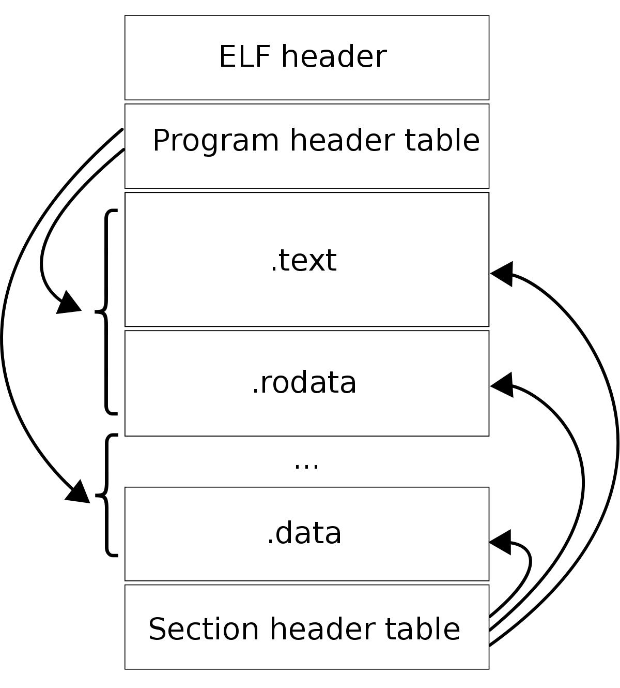

# Woody

This project is about coding a simple packer for Elf64 executables

# Elf64 File Format

#### From `/usr/include/linux/elf.h`


> Although the figure shows the program header table immediately after the ELF header, and the section header table following the sections, actual files may differ. Moreover, sections and segments have no specified order. Only the ELF header has a fixed position in the file.

## Elf Data Types

```c
typedef __u64   Elf64_Addr;
typedef __u16   Elf64_Half;
typedef __s16   Elf64_SHalf;
typedef __u64   Elf64_Off;
typedef __s32   Elf64_Sword;
typedef __u32   Elf64_Word;
typedef __u64   Elf64_Xword;
typedef __s64   Elf64_Sxword;
```

## Elf64 Header

```c
typedef struct     elf64_hdr
{
    unsigned char  e_ident[16];   // ELF "magic number" "\x7fELF"
    Elf64_Half     e_type;        // Object file type
    Elf64_Half     e_machine;     // Machine type
    Elf64_Word     e_version;     // Object file version
    Elf64_Addr     e_entry;       // Entry point virtual address
    Elf64_Off      e_phoff;       // Program header table file offset
    Elf64_Off      e_shoff;       // Section header table file offset
    Elf64_Word     e_flags;       // Processor-specific flags
    Elf64_Half     e_ehsize;      // ELF header size
    Elf64_Half     e_phentsize;   // Size of program header entry
    Elf64_Half     e_phnum;       // Number of program header entries
    Elf64_Half     e_shentsize;   // Size of section header entry
    Elf64_Half     e_shnum;       // Number of section header entries
    Elf64_Half     e_shstrndx;    // Section name string table index
}                  Elf64_Ehdr;
```

### - Fields for a Linux Elf64 executable

| Fields               |  Values                          | Why               |
|----------------------|----------------------------------|-------------------|
|`e_ident`             | `(char *)ELFMAG` of len `SELFMAG`| Magic             |
|`e_ident[EI_CLASS]`   | `ELFCLASS64`                     | 64bit             |
|`e_ident[EI_OSABI]`   | `ELFOSABI_LINUX`                 | Linux             |
|`e_ident[EI_DATA]`    | `ELFDATA2LSB` or `ELFDATA2MSB`   | endian little/big |
|`e_type`              | `ET_EXEC`                        | executable file   |
|`e_entry`             | Not `0`                          | has an entry point|

## Elf64 Section Header

```c
typedef struct     elf64_shdr
{
    Elf64_Word     sh_name;       // Section name, index in string table
    Elf64_Word     sh_type;       // Type of section
    Elf64_Xword    sh_flags;      // Miscellaneous section attributes
    Elf64_Addr     sh_addr;       // Section virtual addr at execution
    Elf64_Off      sh_offset;     // Section file offset
    Elf64_Xword    sh_size;       // Size of section in bytes
    Elf64_Word     sh_link;       // Index of another section
    Elf64_Word     sh_info;       // Additional section information
    Elf64_Xword    sh_addralign;  // Section alignment
    Elf64_Xword    sh_entsize;    // Entry size if section holds table
}                  Elf64_Shdr;
```

### - Fields for a packed `.text` section

| Fields    | Values                                  | Why                  |
|-----------|-----------------------------------------|----------------------|
|`sh_type`  | `SHT_PROGBITS`                          | Program bits         |
|`sh_flags` | `SHF_WRITE + SHF_ALLOC + SHF_EXECINSTR` | mmaped `-rwx`        |

## Elf64 Program Header

```c
typedef struct     elf64_phdr
{
    Elf64_Word     p_type;        // Type of segment
    Elf64_Word     p_flags;       // Segment attributes
    Elf64_Off      p_offset;      // Segment file offset
    Elf64_Addr     p_vaddr;       // Segment virtual address
    Elf64_Addr     p_paddr;       // Segment physical address
    Elf64_Xword    p_filesz;      // Segment size in file
    Elf64_Xword    p_memsz;       // Segment size in memory
    Elf64_Xword    p_align;       // Segment alignment, file & memory
}                  Elf64_Phdr;
```

### - Fields in the corresponding segment for `.text` section

| Fields    | Values               | Why                                |
|-----------|----------------------|------------------------------------|
|`p_type`   | `PT_LOAD`            | Segment should be loaded in memory |
|`p_flags`  | `PF_R + PF_W + PF_X` | Readable Writable Executable       |
