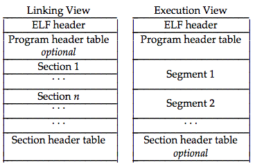

# Elf executables packing

> Apart from the ELF header that is at the beginning of the file, the different elements of an elf can be anywhere as long as they are properly referenced.

## File structure altering

> Section indexes are used throughout the file, for this reason, it is simpler to keep sections (in the section table) in the same order when packing.

If an element is moved, the references to it (file offset) must be updated accordingly :

 * Program header table (`Elf64_Ehdr.e_phoff`)

 * Section header table (`Elf64_Ehdr.e_shoff`)

## Entry point

Code from the `.init` section is executed before execution jumps to the `e_entry`.

> .init -- This section holds executable instructions that contribute to the process initialization code. That is, when a program starts to run, the system arranges to execute the code in this section before calling the main program entry point (called main for C programs).
